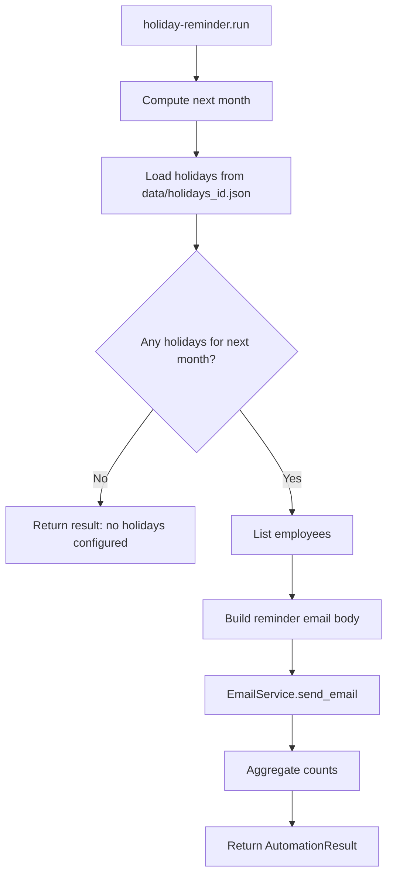

# Automation Flowchart

## Overall Automation Flow

```mermaid
flowchart TD
    A[CLI Entry] --> B{Command Group}
    B -->|employee/claim/payslip/auth| C[Existing command handlers]
    B -->|automation| D[automation_runner]

    D --> E[run_due or run_one]
    E --> F{For each automation in order}
    F --> G{should_run(run_date)?}
    G -->|No| H[Skip]
    G -->|Yes| I[automation.run(run_date)]
    I --> J[AutomationResult]
    J --> K[CLI prints JSON result]
```

Registered automations:
1. **holiday-sync** -- parse government PDF to populate holidays_id.json (manual trigger only)
2. **holiday-reminder** -- email employees about next month's holidays (last day of month)
3. **payslip-send-all** -- generate and send payslips (manual only)

## Holiday Sync Flow (manual + auto discovery)

```mermaid
flowchart TD
    A[python -m app.cli holiday sync-auto --year YYYY] --> B[HolidayPdfDiscoveryService]
    B --> C[Scan trusted seed pages (.go.id)]
    C --> D[Score PDF candidates by year + keywords]
    D --> E[Download and validate PDF bytes]
    E --> F[holiday-sync run_with_pdf]
    F --> G[HolidaySyncService.extract_holidays_from_pdf]
    G --> H[OpenAI vision extraction (gpt-4o)]
    H --> I{Confident enough?}
    I -->|Yes| J[Write categorized JSON by year]
    I -->|No| K[Embedded PDF text + Ollama JSON fallback]
    K --> L{Confident enough?}
    L -->|Yes| J
    L -->|No| M[Send failure alert email]

    A2[python -m app.cli holiday sync PDF_PATH] --> F
```

## Holiday Reminder Flow


